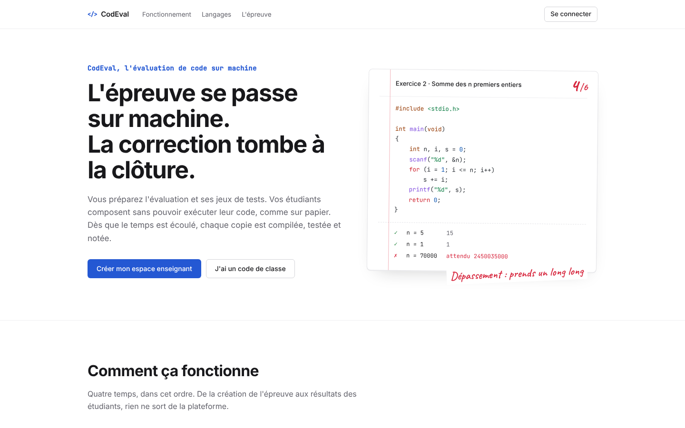
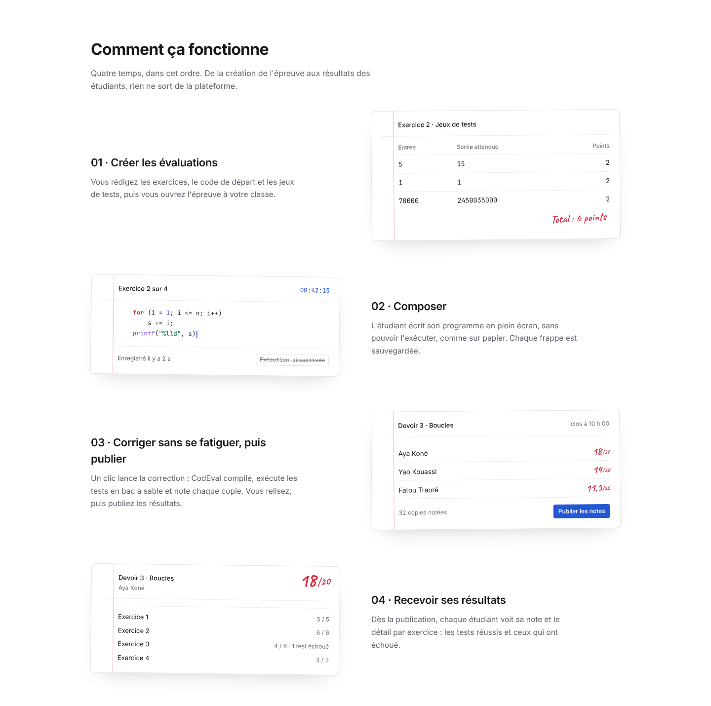
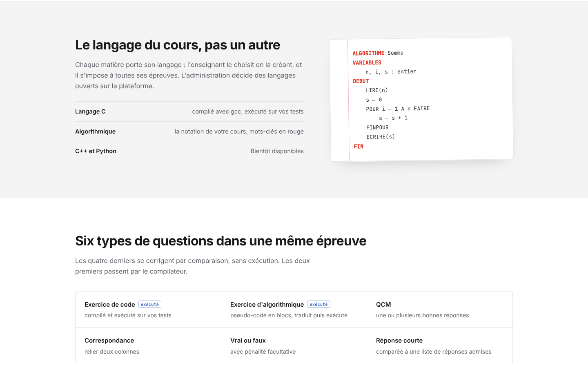
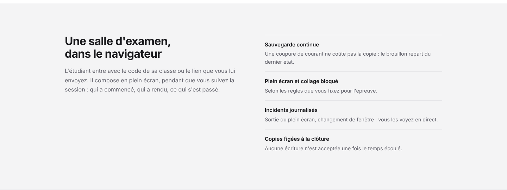
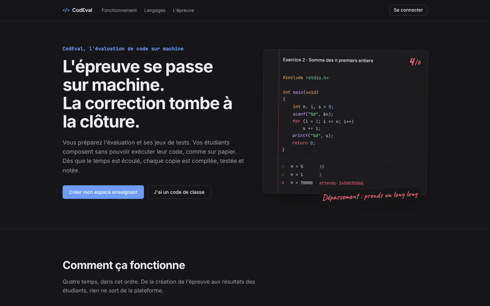
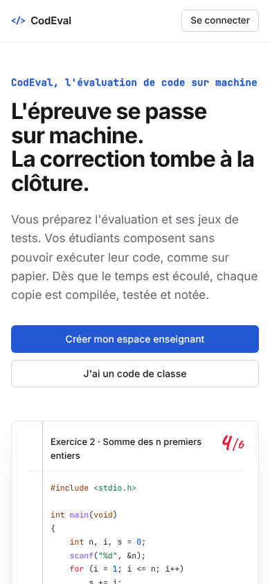

# CodEval

**Plateforme SaaS d'évaluation pratique en programmation et en algorithmique.**

L'enseignant prépare une épreuve et ses jeux de tests. Les étudiants composent sur
machine, en plein écran, sans pouvoir exécuter leur code, comme sur papier. Dès la
clôture, chaque copie est figée, compilée, exécutée dans un bac à sable et notée
automatiquement.



> **Le code source est privé.** Ce dépôt présente le projet : ce qu'il fait, comment il
> est construit et les choix techniques qui le structurent. Je peux faire une
> démonstration ou donner un accès en lecture au dépôt complet sur demande.

---

## En bref

| | |
| --- | --- |
| **Rôle** | Conception, développement et déploiement, seul, de bout en bout |
| **Stack** | Python 3.12 · FastAPI · SQLAlchemy 2 · PostgreSQL 17 · Alembic · React 19 · Vite · TanStack Query · CodeMirror |
| **Infra** | Docker · HTTPS · e-mails transactionnels |
| **Taille** | ≈ 43 000 lignes (Python, JavaScript, CSS) · 12 migrations Alembic · 67 tests d'intégration sur PostgreSQL |
| **Utilisateurs** | 3 rôles : administration, enseignant, étudiant |

---

## Le problème

Évaluer la programmation sur papier est lent à corriger et ne ressemble pas au métier.
L'évaluer sur machine pose d'autres problèmes : l'étudiant peut tester jusqu'à tomber
juste, copier-coller, ouvrir un autre onglet, et l'enseignant se retrouve à compiler à la
main des dizaines de copies.

CodEval reprend les règles de l'épreuve sur papier (pas d'exécution, temps limité, copie
rendue et figée) et automatise tout le reste : la surveillance, le gel des copies, la
compilation, l'exécution des tests et la notation.

## Comment ça fonctionne



```
Enseignant                          Étudiant                     Système
──────────                          ────────                     ───────
crée l'évaluation
  + exercices + jeux de tests
programme la session  ────────────► voit l'épreuve à venir
ouvre la session      ────────────► compose en plein écran
                                    (sans exécution)
                                    rend sa copie          ────► fige la production
clôture (ou fin du temps)                                  ────► gèle toutes les copies
lance la correction                                        ────► worker : compile,
                                                                  exécute, note
relit, ajuste, annote
publie les résultats  ────────────► consulte sa copie corrigée
exporte (Excel / CSV)
```

## Fonctionnalités

### Six types de questions dans une même épreuve



| Type | Correction |
| --- | --- |
| **Exercice de code** (C, C++, Python) | compilation + exécution en bac à sable + jeux de tests (`trim`, `exact` ou `numeric`) |
| **Algorithmique en blocs** | l'algorithme (LIRE, ECRIRE, SI, POUR, TANT QUE…) est traduit en Python puis passe par le même bac à sable et les mêmes tests |
| **QCM** | choix unique ou multiple, note partielle |
| **Correspondance** | proportion de paires correctement reliées |
| **Vrai / faux** | avec pénalité facultative |
| **Réponse courte** | formulations acceptées (casse, accents, ponctuation ignorés) ou mots-clés ; sans corrigé, la copie est signalée pour correction manuelle |

### Une salle d'examen dans le navigateur



- **Plein écran obligatoire, copier-coller bloqué**, selon les règles fixées par l'enseignant.
- **Détection des comportements suspects** pendant l'épreuve, journalisés et
  **décomptés côté serveur**. Au-delà d'un seuil fixé par l'enseignant, la copie est
  gelée automatiquement.
- **Résistance aux pannes** : une coupure réseau ou de courant ne fait perdre ni le
  travail ni le temps d'épreuve.
- **Compte à rebours synchronisé sur l'horloge du serveur**, pas sur celle du poste.
- **Suivi en direct** côté enseignant : qui est connecté, qui a rendu, journal des incidents ;
  prolongation ou clôture à tout moment.

### Côté enseignant

- Éditeur d'évaluation en quatre étapes : paramètres → exercices → correction → points & publication.
- Banque d'exercices réutilisables, partageables dans l'établissement.
- Gestion des classes, invitation des étudiants par code ou lien.
- Relecture des copies, **réajustement de note tracé** (auteur, ancienne note, motif, date),
  relance de correction, publication, export Excel / CSV, statistiques.
- Espace communautaire d'exercices notés par les enseignants.

### Côté administration

Tableau de bord, gestion des utilisateurs et des classes, ouverture ou fermeture des
langages pour toute la plateforme, journal d'audit filtrable.

### Transverse

Thème clair / sombre, interface responsive, vérification d'e-mail par code à six chiffres,
mot de passe oublié, suppression de compte, notifications, SEO (Open Graph, données
structurées).

<p align="center">
  
  &nbsp;
  
</p>

---

## Architecture

```
                 ┌────────────────────────┐
  navigateur ───►│  React 19 + Vite (SPA) │  3 espaces : admin · enseignant · étudiant
                 └───────────┬────────────┘
                             │ REST + JWT
                 ┌───────────▼────────────┐
                 │   API FastAPI          │  autorisation à chaque requête,
                 │   + planificateur      │  ouverture des sessions programmées
                 └───────────┬────────────┘
                             │
                 ┌───────────▼────────────┐
                 │     PostgreSQL 17      │  données + file de correction (une table)
                 └───────────▲────────────┘
                             │ SELECT … FOR UPDATE SKIP LOCKED
                 ┌───────────┴──────────────┐
                 │ Worker(s) de correction  │  compile, exécute en bac à sable, note
                 │ réplicables              │
                 │                          │
                 └──────────────────────────┘
```

### Cycle de vie d'une évaluation

```
draft ──► scheduled ──► running ──► closed ──► correcting ──► corrected ──► validated
                                                    │
                                                    └──► relance : nouvelle campagne numérotée
```

### Choix techniques

- **Correction hors de l'API.** Les campagnes de correction sont consommées par un
  worker distinct et réplicable, pour qu'une correction de 500 copies ne ralentisse pas
  les étudiants qui composent au même moment.
- **Pas d'infrastructure superflue.** Pas de Redis ni de RabbitMQ : la file de
  correction est une table PostgreSQL, et la réservation sans attente
  (`SKIP LOCKED`) suffit à faire coexister plusieurs workers.
- **Idempotence.** Le traitement est idempotent par `(campagne, participation, exercice)` :
  un worker tué en pleine correction reprend sans produire de doublon. Une relance
  crée une nouvelle campagne sans écraser l'historique.
- **Exécution de code non fiable isolée.** Le code des étudiants s'exécute dans un bac à
  sable aux ressources limitées, derrière une interface `Sandbox` qui permet de changer
  de niveau d'isolation sans toucher au moteur de correction.
- **Intégrité des corrigés.** Les bonnes réponses ne quittent jamais le serveur avant la
  publication des résultats : elles sont retirées de tout ce qui est envoyé à l'étudiant.
- **Copies figées à la clôture.** Chaque participation reçoit un `frozen_at` et l'API
  refuse ensuite toute écriture : la correction ne démarre jamais sur une copie encore
  modifiable.
- **Multi-établissements.** Toutes les données sont rattachées à une organisation et
  filtrées à chaque requête ; un enseignant ne voit que ses propres évaluations.
- **Traçabilité.** Ajustements de note, opérations sensibles et incidents sont journalisés.

Extrait : la réservation d'une campagne par un worker.

```python
def claim_next(db) -> CorrectionRun | None:
    stmt = select(CorrectionRun).where(CorrectionRun.status == RunStatus.PENDING).limit(1)
    if db.bind.dialect.name == "postgresql":
        stmt = stmt.with_for_update(skip_locked=True)
    run = db.scalar(stmt)
    if run is None:
        return None
    run.status = RunStatus.RUNNING
    run.started_at = utcnow()
    db.commit()
    return run
```

---

## Mesures de performance

J'ai construit un banc de mesure reproductible qui appelle le vrai moteur de correction
et le vrai bac à sable, sur un jeu de 500 copies générées avec une graine fixée
(réponses correctes, partielles, erreurs de compilation, boucles infinies, copies vides).

| Mesure | Résultat |
| --- | --- |
| Débit de correction (banc local) | **≈ 117 copies / minute**, stable de 40 à 1 000 copies |
| 1 000 copies corrigées | 8 min 34 s, **0 échec** |
| Coût médian par test | analyse 108 ms · compilation 51 ms · exécution 249 ms |
| Découpage fin (une tâche = une réponse) avec 8 workers | **≈ 263 copies / minute**, soit × 2,2 par rapport au découpage par campagne |
| Reprise après crash d'un worker | 60 / 60 copies corrigées, **aucun doublon** |

Le banc a orienté la suite : le découpage fin des tâches est la prochaine évolution du
moteur de correction.

---

## Qualité et déploiement

- **Tests d'intégration sur PostgreSQL** (mêmes types et mêmes verrous qu'en production)
  couvrant le parcours complet : inscription, rôles, création d'une évaluation, ouverture
  de session, sauvegarde, soumission, gel, **correction réelle avec compilation et
  exécution**, ajustement tracé, relance d'une seconde campagne, export.
- **Lint** ESLint côté frontend, build Vite vérifié.
- **Migrations** Alembic, attente de la base au démarrage, schéma reproductible sur base vide.
- **Déploiement** conteneurisé (Docker), HTTPS, sauvegardes automatisées.
- **E-mails** transactionnels avec domaine authentifié (SPF / DKIM / DMARC).

---

## Ce que ce projet m'a appris

- Concevoir un système où **l'intégrité est garantie côté serveur**, pas par l'interface.
- Faire tourner **du code non fiable** en toute sécurité.
- Utiliser PostgreSQL comme **file de tâches concurrente** et rendre un traitement
  **idempotent**.
- **Mesurer avant d'optimiser** : le banc de mesure a montré où se trouvait vraiment la
  limite de passage à l'échelle.
- Livrer un produit complet seul : modèle de données, API, interface, déploiement,
  e-mails, documentation.

---

## Contact

Projet développé par **[@dagbokady](https://github.com/dagbokady)**.
Démonstration ou accès au code source sur demande.
